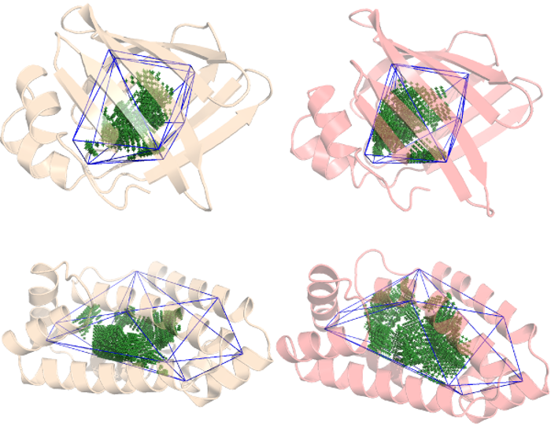
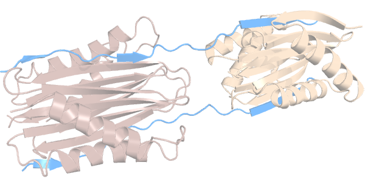
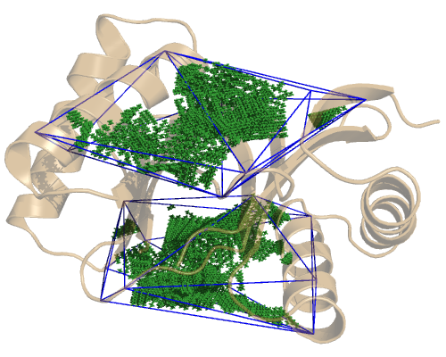
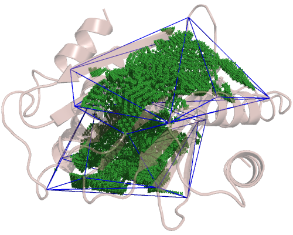

**Along this tutorial we will be referring to PCA and NMA vectors as "vectors", "modes" and "collective coordinates", indistinctly.**

ANA allows to quantify the flexibility of a cavity using a PDB structure and a set of collective coordinates
(vectors) and their frequencies. These two may come from either an analysis of a Molecular Dynamics
run ---Principal Component Analysis, or PCA---, or a Normal Mode Analysis (NMA) of a protein PDB structure,
but the calculation itself doesn't change between them: ANA will displace the protein cavity along each vector
and calculate its effect on the total volume, by summing up all the effects on the cavity ANA can quantify the overall
flexibility of the cavity.
As always, all the files are available [**online**](https://github.com/anadynamics/ANA2/tree/master/aux/flexibility).

## Based on Principal Component Analysis from a Molecular Dynamics trajectory

Since ANA is able to read vectors and frequencies from the
[**Amber PCA file format**](https://pubs.acs.org/doi/abs/10.1021/j100384a021), we'll first check an example
of this specific case.
 
We continue our previous work with the Lipid Binding Proteins from the [**Flexibility**](flexibility.html) tutorial. 
by adding another b-sheet LBP and considering the apo and holo structures for each protein.
We will be identifying each protein by their PDB ID: **4XCP** and **4UET** are the α-helix LBP with and without a
ligand (palmitate), while **2IFB** and **1IFB** are the β-sheet LBP with and without the same palmitate ligand.

As we've already seen, **4XCP** (palmitate bound α-helix LBP) presents at least 2 conformers so there is some
flexibility associated with this bound protein but how flexible is it exactly? And how does it compare against
its ligand-free form and a β-sheet LBP?



The cavity has already been defined following the steps described in the [**Quickstart**](quickstart.html)
and we also set ANA to High precision (`included_area_precision = 1`), so let's
focus on the flexibility specific options. Flexibility calculations are based on the Non-Delaunay Dynamics
method (described [**here**](https://doi.org/10.1021/acs.jctc.7b00744)), so all their specific options begin
with **NDD_**. Both configuration files (**config_alfa.cfg** and **config_beta.cfg**) have these 3 lines:

```
NDD_modes_format = amber
NDD_particles_per_residue = 1
NDD_step = 3
```

`NDD_modes_format `the `amber` format, since we have Amber PCA vectors (**modes_4uet**, **modes_4xcp**,
**modes_1ifb** and **modes_2ifb**). These vectors have an **x**, **y** and **z** component for each 
particle and what "particle" means depends on the coarse grain model. In this case, we have an alpha
carbon model, so each residue will be represented by 1 particle, we let ANA know this in the second line.
To read more about the `NDD_particles_per_residue` option check the [**reference section**](config.html#ndd-options).

The third line, `NDD_step = 3` tells ANA how far do we want to go with the calculation. ANA performs the
NDD method in 3 steps:

1. In the first step, ANA calculates two volumes corresponding to structural + and - displacements in the direction of each PCA mode.
2. In the second step, ANA calculates the corresponding partial derivatives numerically by using the difference in
the volumes between each pair of displaced structures. Partial derivatives are the components of the
**Volume Gradient Vector** (**VGV**). This VGV corresponds to the direction of maximum cavity volume change and
is given as vector expressed on the basis of PCA modes.
3. In the third and final step, ANA makes use of the VGV vector and the input frequencies to calculate the flexibility
of the cavity. When `NDD_modes_format` is set to `amber`, ANA will assume these frequencies come in units of *1/cm*.


If we wanted to perform just the first steps, then we would have to specify the terminal option
`NDD_output`, since we will be getting 2 vectors with the displaced volumes (if `NDD_step = 1`) or the VGV
(when `NDD_step = 2`). Since `NDD_step = 3` ANA will just output the flexibility to the console.

We now turn our attention to the **step_1.sh** script file:

```
ANA2 avg_4uet.pdb -c config_alfa.cfg -M modes_4uet -Z 5

ANA2 avg_4xcp.pdb -c config_alfa.cfg -M modes_4xcp -Z 5

ANA2 avg_1ifb.pdb -c config_beta.cfg -M modes_1ifb -Z 5

ANA2 avg_2ifb.pdb -c config_beta.cfg -M modes_2ifb -Z 5
```

Notice that all PDB names begin with **avg_**, these are the most representative structures from our trajectories
for each system. This is necessary since the PCA vectors we have (**modes_**...) were calculated in reference to
an average structure, so we took the closest frame of our trajectory to that theoretical average. The name of the
file with the PCA vectors and their frequencies are specified using the flag `-M`.
We also see a new terminal option `-Z` or `--NDD_size`, this is a multiplier that affects how much ANA displaces
the cavity along each vector. Different proteins and different cavities may need different magnitudes, but so far
a value of 5 has been the most reliable magnitude. If you wish to check the convergence of the calculation, you
can rerun the calculations with a `--NDD_size` (`-Z`) of, say, `3`, `4`, `6` and `7`. 

This is the output we get from **step_1.sh**:

```
> ./step_1.sh 
Beta without ligand
Rigidity:  17.0524105435

Beta with ligand
Rigidity:  26.5299406277

Alpha without ligand
Rigidity:  39.1154196453

Alpha with ligand
Rigidity:  31.4367172631
```

ANA gave us a parameter representing the rigidity of each protein's cavity; the lower, the more flexible the cavity is.
So, while B-sheet LBP becomes more rigid when binding its ligand, the α-helix LBP becomes more flexible.
More details about this particular system can be found [**elsewhere**](https://doi.org/10.1021/acs.jcim.9b00364).

### Physical meaning of the rigidity result

Both PCA and NMA assume the protein's movements along the collective coordinates are harmonic. Therefore,
the protein's cavity would also change harmonically and its energy change would follow the hamonic potential energy equation:


where,

- *ΔE*: cavity's potential energy
- *k*: spring constant
- *ΔX*: displacement along the VGV

ANA reports the spring constant ---in units of *KJ/mol* and in the direction of the VGV---, as a measure of the
cavity's rigidity (or flexibility).
For a given magnitud of potential energy, the lower this value is, the higher the displacement along the VGV will be.
That is, the more flexible the cavity will be.

## Based on Normal Mode Analysis

We now compare the flexibility of the cavities of 2 different proteins, but with similar function. They belong
to the dynein family of cytoskeletal motor proteins that move along microtubules.
Specifically, these are called *dynein light chains* and they both interact, through their cavities, with a 
disordered region of another dynein protein:



We have two homodimeric dynein light chains: Tctex1 (in dark salmon) and LC8 (in sand color). Each have 2 identical cavities
---which we will call cavities **C** and **D**---, through which they interact with a disordered region of another
protein (in light blue). 

If we check each domain separately, we see where their cavities lie. The LC8 domain: 


and the TcTex1 domain, which is a bit bigger:



So, since we have 4 cavities, we have 4 configuration files. Only the `included_area_residues` option changes
between them, so we'll focus on the NDD specific options:

```
NDD_modes_format = column
NDD_particles_per_residue = 1
NDD_step = 3
```

The only change with respect to the LBPs configuration files is the input vectors format (`NDD_modes_format` option),
now set to `column` since these are not Amber PCA vectors, but NMA vectors in a file where each column represents a normal mode.

The files with the NMA vectors for each structure are called **modes_lc8** and **modes_tctex**.
We also have the files with the frequencies for each structure: **frequencies_lc8** and **frequencies_tctex**. This frequency files must have a
single column with a single frequency at each row and a fixed column width.
There should also be one frequency per vector, otherwise ANA will let you know and cancel the run.

The execution lines are inside the **./step_1.sh** file:

```
ANA2 lc8.pdb -c ecf.cfg -M modes_lc8 -F frequencies_lc8

ANA2 lc8.pdb -c edf.cfg -M modes_lc8 -F frequencies_lc8

ANA2 tctex.pdb -c acb.cfg -M modes_tctex -F frequencies_tctex

ANA2 tctex.pdb -c adb.cfg -M modes_tctex -F frequencies_tctex
```

We see a new flag `-F`, this points ANA to the file with the frequencies. When `NDD_modes_format` is
set to `column`, ANA will assume this frequencies come in units of *1/s^2*.

Let's run our **./step_1.sh** script:

```
> ./step_1.sh 
LC8 cavity C
Rigidity:  14.4987643740

LC8 cavity D
Rigidity:  14.9998844721

TcTex cavity C
Rigidity:  12.3797292878

TcTex cavity D
Rigidity:  13.2121455156
```

That is TcTex1's cavities are more flexible than LC8's.
Indeed, we were able to capture this higher flexibility in MD runs (not published).


### Addendum

1. Notice that all the shorthands for the NDD terminal options (like `-M`, `-Z`, `-F`,...) are capitalized.

