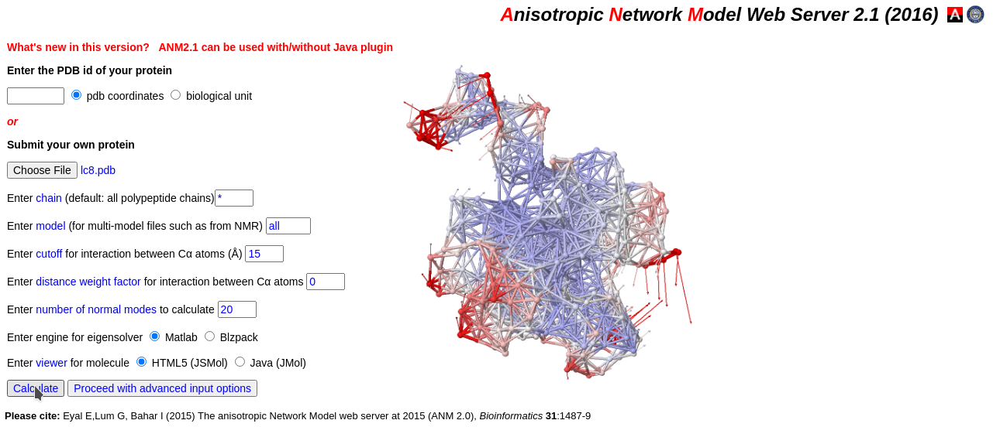
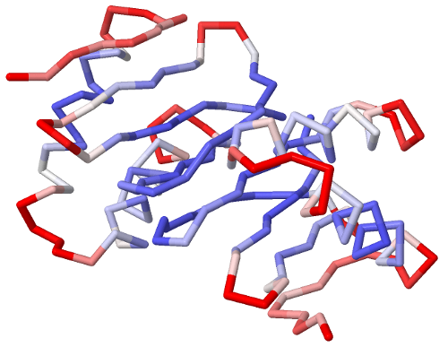
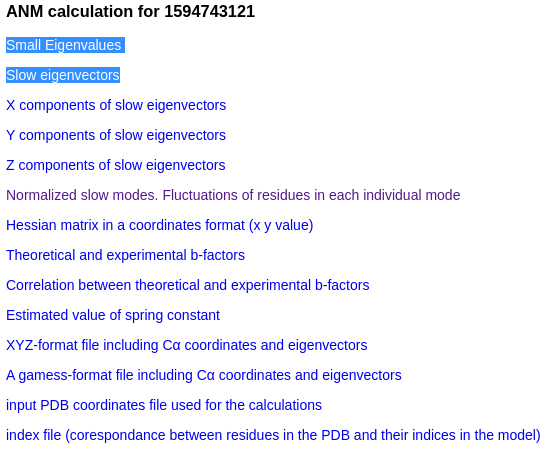

Let's say you have a few structures and you want to characterize the flexibility of their cavities, but you
can't run MD or NMA, at least not locally. You can always upload your PDBs at Bahar's [**server**](http://anm.csb.pitt.edu/) and get
the first, say, 20 normal modes and their frequencies and then use ANA to calculate the cavitties flexibilities.
In this tutorial, we're going to do just that. As always, all the files are available [**online**](https://github.com/anadynamics/ANA2/tree/master/aux/bahar_dynein).

We will be using the same dynein structures we used on the [previous tutorial](flexibility.html), just to be sure we're not getting
the wrong results.

## NMA using Bahar's server

We upload **lc8.pdb** to the [**server**](http://anm.csb.pitt.edu/) and run the calculations without changing the defaults, just to be quick.



We get an animation of the first normal model like the one on the next image, and a panel of options.



We go straight to **Download files** and download from the first 2 links, "Small Eigenvalues" and "Slow eigenvectors".



We name the eigenvalues as **pre_frequencies_lc8** and the eigenvectors as **pre_modes_lc8**. These 2 files require
minor formatting changes before using them. In both files, we delete the first column with the row numbers since
these are not informative. In addtion, in the eigenvalues file ---**pre_frequencies_lc8**---, we delete the first 6 rows
since these correspond to the translational and rotational frequencies so they have no real information. We also delete
the last 10 rows since, for some reason, the server gave us 20 eigenvectors and 36 eigenvalues. After these modifications,
we have 20 eigenvectors (in the properly formatted **modes_lc8** file) and 20 eigenvalues in the **frequencies_lc8** file.
We do the same for the tctex homodimer and get another two files: **modes_tctex** and **frequencies_tctex**.

## Flexibility Index

We now have the vectors and the frequencies of both homodimers. Those are the only new files with respect to
the previous tutorial. The structures are the same, so the cavities are the same and ANA's configuration files too.

The contents of our running script **./step_1.sh**:

```
ANA2 lc8.pdb -c ecf.cfg -M modes_lc8 -F frequencies_lc8

ANA2 lc8.pdb -c edf.cfg -M modes_lc8 -F frequencies_lc8

ANA2 tctex.pdb -c acb.cfg -M modes_tctex -F frequencies_tctex

ANA2 tctex.pdb -c adb.cfg -M modes_tctex -F frequencies_tctex
```

Let's run our **./step_1.sh** script:

```
> ./step_1.sh 
LC8 cavity C
Flexibility:  0.2432334785

LC8 cavity D
Flexibility:  0.3390829314

TcTex cavity C
Flexibility:  0.5518120665

TcTex cavity D
Flexibility:  0.5292739607
```

Again, the absolute value flexibility index is not exact, but we notice the same difference in flexibility we saw before:
TcTex1 has more flexible cavities than LC8.

Notice that this time we only used 20 vectors and 20 frequencies, instead of the whole set of collective coordinates
(504 for LC8 and 576 for TcTex1), as we did in the [previous tutorial](flexibility.html). Yet, we still got the same result.
This is because we used the first 20 normal modes, the ones with the lowest frequencies and more biological relevance.
