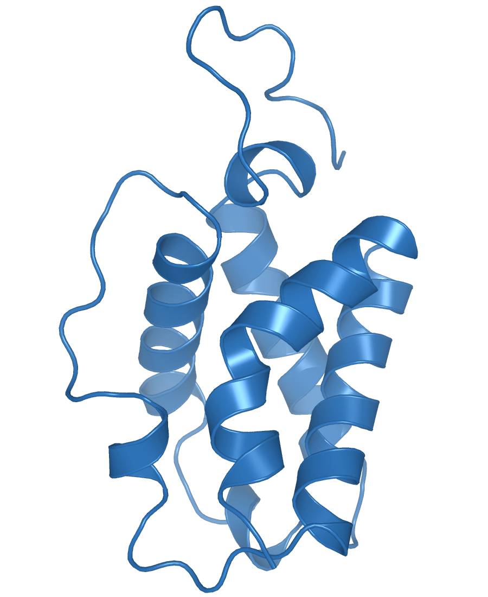
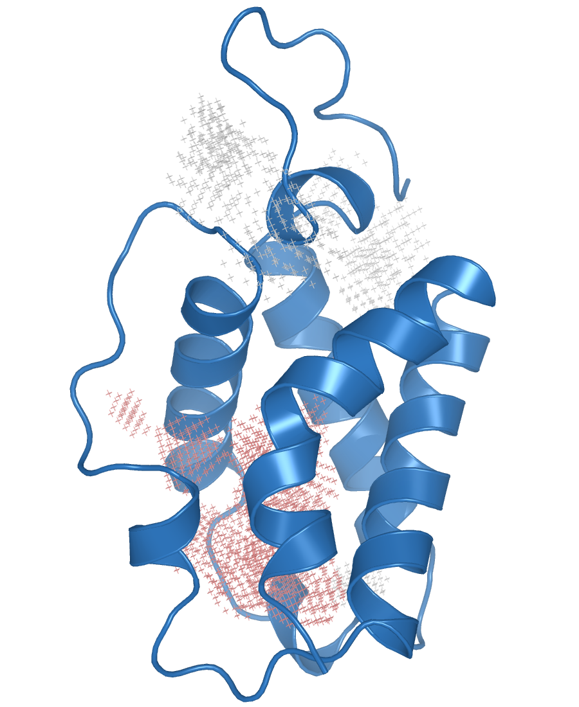
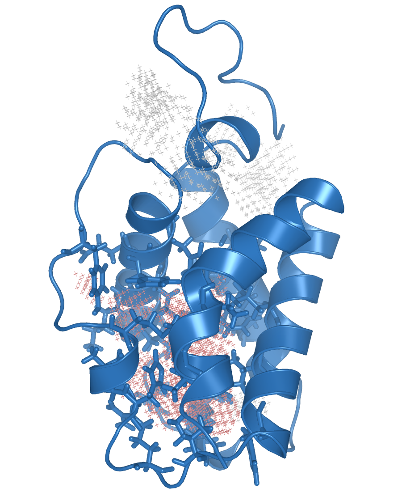
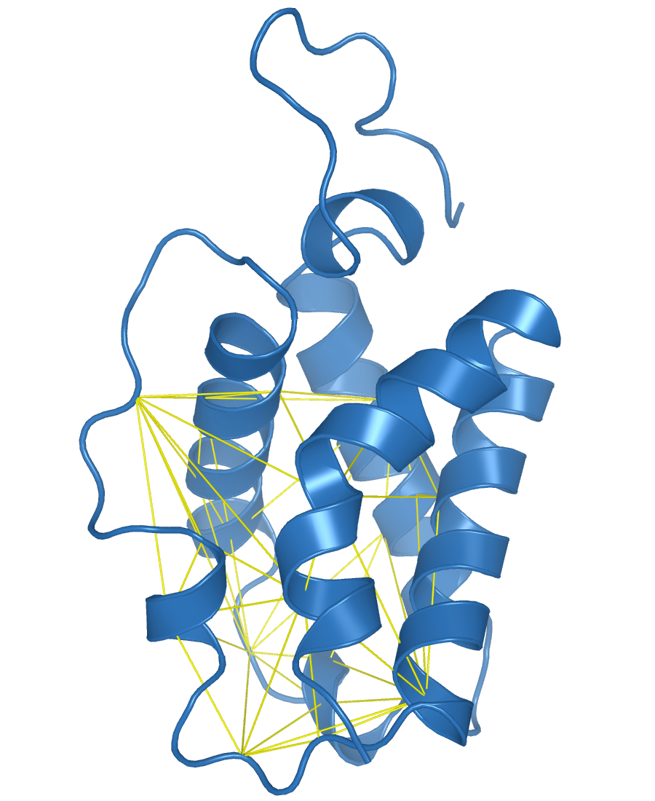
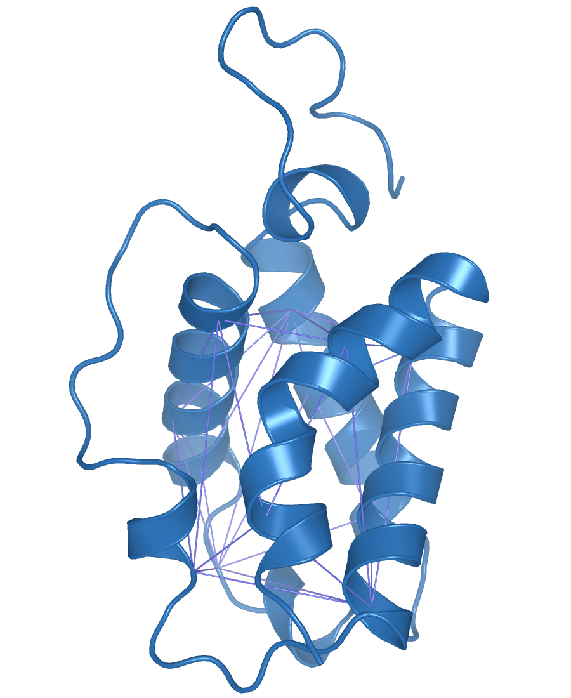
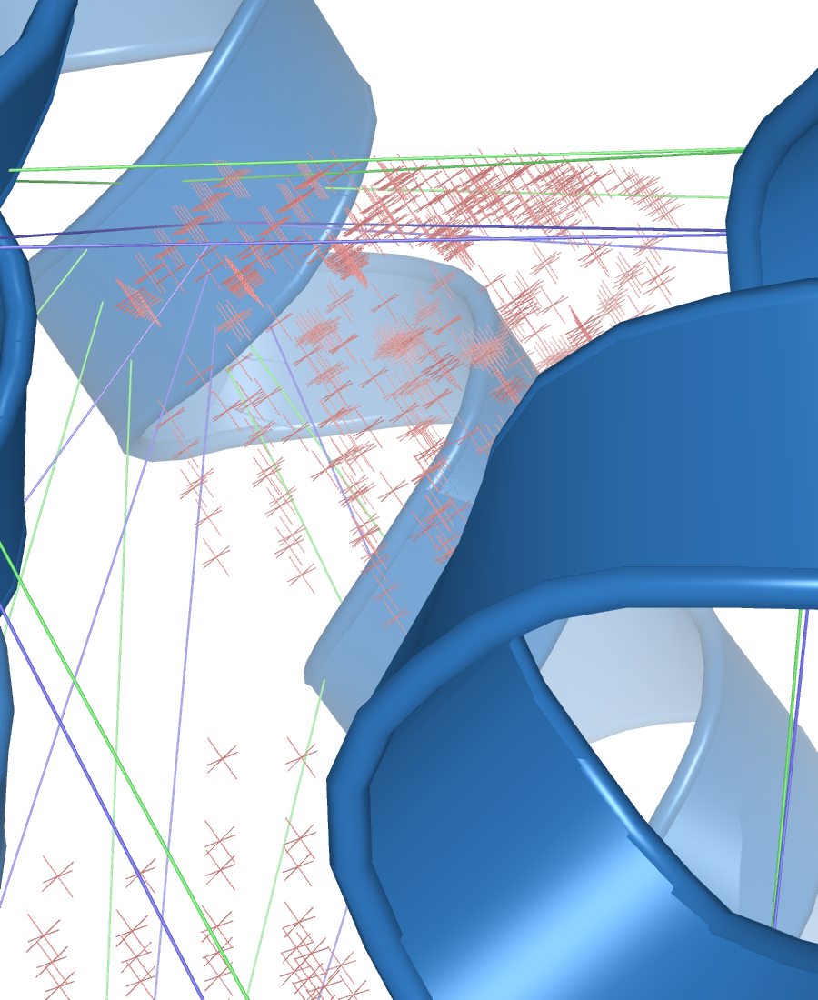

Let's start with an easy example of what a typical use case would be like.
We'll be calculating the volume of the main cavity of a truncated haemoglobin along
a **very** short trajectory.
You can get all files used in this example [here](https://www.dropbox.com/sh/9xnbbap2aqyoepp/AACvXFgeN1JZKpel4BQmiBrna?dl=0).



You can imagine that the pocket we are after is the one delimited by those 4 
α-helices. The exact definition of a pocket is hard to define (probaly
impossible, since there is no such thing), but we'll do our best.

First, let's run ANA naively, without any configuration file:
```
> ANA2 1mtn.pdb -f 1_salida

Pocket 1        124.569
Pocket 2        191.057
Pocket 3        475.634
Pocket 4        17.2347
```
We get 4 output files, each with a different pocket. We load them on pymol,
along with the input structure and see something like this:



The 3rd pocket (the salmon colored one) is close to the one we want, so
we'll choose that one. Later we'll see how to fix that protuberance going
outside the area delimited by the four helices (on the left of the image).

In order to draw an included area to track this pocket, we need the residues
that surround it and a 1st approach to get them is to get the wall aminoacids.
In order to get them, we have to write our 1st configuration file:
```
list_wall = residue
separator = +
```
The *residue* keyword tells ANA we want a list of amino acids, the
alternative would be to use the *atom* keyword, to get every atom that is in
contact with the cavity, something which obviously ends up generating an
annoyingly long list sou you'll probably never use it.

We'll see later why we specified '+' as the separator character. Let's run it:
```
> ANA2 1mtn.pdb -c 1.cfg -f 1_salida -w wall_1mtn
```

Thus, we get the output file called *wall_1mtn*. This is the section that
matters to us:
```
pocket_3        Frame: 1

RESN |  VAL+VAL+PHE+TYR+PHE+PHE+THR+LEU+LYS+GLN+GLU+PHE+PHE+TYR+MET+VAL+HID+ARG+ILE+HID+VAL+LEU+ILE+LEU+OXY
RESI |  28+29+32+33+45+46+49+54+57+58+60+61+62+72+77+80+81+84+86+90+94+98+119+122+128
-------------
```
We now can copy the residue list and see them on pymol. Pymol needs the residue
list to be separated with '+' characters, like this:
```
select resi 28+29+32+33+45+46+49+54+57+58+60+61+62+72+77+80+81+84+86+90+94+98+119+122+128
```



And that's why setting the *separator* variable is useful. If you want a more
readable (tab separated) list you can simply remove that line in the config
file:
```
list_wall = residue
```
and re-run it:
```
> ANA2 1mtn.pdb -c 2.cfg -f 1_salida -w wall_1mtn
```
to get a nicer output:
```
pocket_3        Frame: 1

RESN |  VAL     VAL     PHE     TYR     PHE     PHE     THR     LEU     LYS     GLN     GLU     PHE     PHE     TYR     MET     VAL     HID     ARG     ILE     HID     VAL     LEU     ILE     LEU     OXY 
RESI |  28      29      32      33      45      46      49      54      57      58      60      61      62      72      77      80      81      84      86      90      94      98      119     122     128
-------------  
```


Now, let's paste this list in the configuration file to draw an included area.
```
included_area_residues = 28      29      32      33      45      46      49      54      57      58      60      61      62      72      77      80      81      84      86      90      94      98      119     122     128 
included_area_precision = 1
```
and run it using the *--tool_check_CH* or *-t* flag. This will draw the convex hull obtained
by triangulating the alpha carbons from the residues listed in the 
*included_area_residues* variable.

```
> ANA2 1mtn.pdb -c 3.cfg -f 1_salida --tool_check_CH ch_3_testing
```
If we load the *ch_3_testing.pdb* file on pymol, we'll see something like this:



Now, as we said before, this was not exactly the pocket we were looking for. We
have to modify the list of residues to define a proper cavity using the convex
hull method.

It does not take long to get a sense of the resulting
convex hull, given a set of points (alpha carbons, in our case). Whenever you
see a problematic vertex (for example, the residue 72 that is causing the 
included area to have a protuberance to the left), remove it from the list.

Also, you don't want too many unnecessary residues listed in the
*included_area_residues* variable, since this will result in a minor though
unnecessary overhead.

After pruning the list (removing several residues and adding new ones to
get a more elongated cavity), we are left with this config file:
```
included_area_residues = 25      29      36      49      54      57      58      65      81      90      94      102      115     122     128 
included_area_precision = 1
```
We re-run the check to see the resulting convex hull:
```
> AN2 1mtn.pdb -c 4.cfg -f 1_salida -t ch_4_testing
```
and load the *ch_4_testing.pdb* file on pymol:



We're now ready to track our pocket. We use the *-d* flag (think of dynamics)
to include the trajectory

```
> AN2 1mtn.pdb -c 4.cfg -d mtn.nc -f salida

1       431.968
2       429.337
3       406.303
4       469.237
5       444.573
6       466.983
7       392.346
8       486.814
9       438.019
10      455.87
Writing output...
Done
```
And now *salida.pdb* is a trajectory file with our pocket dynamics. 
Using the *-t* flag you can see how the included area changed during the
trajectory, following the listed residues.
```
> ANA2 1mtn.pdb -c 4.cfg -d mtn.nc -f salida -t ch_5_testing
```
Now, the output of *--tool_check_CH* is also a trajectory file. If we load it and zoom
in, we can see the differences between the original (purple) static convex hull
and the dynamic one (green):



Now you can play with the files if you want. You can change the cavity
definition if you don't agree with mine and re-run the calculation. The good
news is that, given a longer-than-10-frames trajectory, (which is usually the
case) there won't be much difference.


### Addendum

1. Remember that whenever you use a tool like *--tool_check_CH*, ANA will only perform
that task and exit, so you won't get any output other than the output from the
tool.
2. You can redirect ANA's volume output to a file like this:
```
> ANA2 1mtn.pdb -c 4.cfg -d mtn.nc -f salida -v output_vol
Writing output...
Done
```
