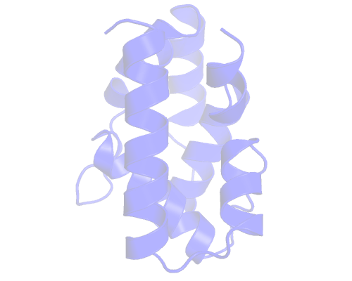
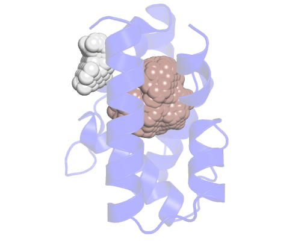
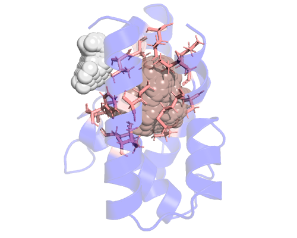
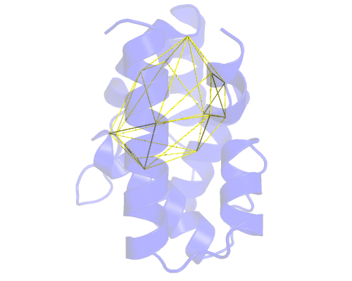
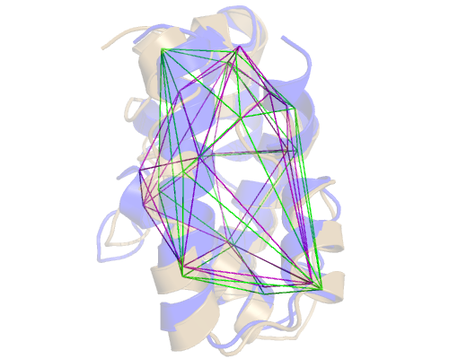

Let's start with an easy example of what a typical use case would be like.
We'll be calculating the volume of the main cavity of an Odorant Binding Protein along
a **very** short trajectory.
You can get all files used in this example [here](https://github.com/anadynamics/ANA2/tree/master/aux/quickstart).



The pocket we are after is located in the center, delimited by those α-helices.
The exact definition of a pocket is hard to define but we'll do our best.

First, let's run ANA naively, without any configuration file:

```
> ANA2 input_pdb.pdb -f 1_cavity

Pocket  253.536
Pocket  38.5048
```

The input structure always go first, so you won't need to write its flag, this
is the only mandatory argument when running ANA. The flag `-f` is the shorthand
for the `--output_draw` argument. **1_cavity** will be the prefix for all
the output cavities ANA finds. 

In this case we get 2 output files, each with a different pocket. If we load
them on pymol (or any other biomolecule visualizer), along with the input
structure, we'll see something like this:



The first pocket (the salmon colored one) is close to the one we want, so
we'll choose that one. We can also guess there should be more empy space under
it but for some reason ANA is not showing it. We'll see how to fix this.

In order to draw an Included Area to track this pocket, we need the residues
that surround it and a first approach to get them is to get what ana calls
*wall residues* or *wall atoms*.
In order to get them, we have to write our first configuration file. ANA
configuration files are just plain text files where each line is composed of an
option, followed by a '=' character, and the appropriate arguments. So we will
create a new file, write the following contentents in it and call it
**config_1.cfg**. The **.cfg** extension tells the VIM editor this is a config
file, so VIM can provide appropriate highlighting. This is a nice-to-have, but is
not necessary, ANA can't tell the difference.

```
list_wall = residue
separator = +
```

The *residue* keyword tells ANA we want a list of amino acids, the
alternative would be to use the *atom* keyword, to get every atom that is in
contact with the cavity. We don't need that level of detail, so we'll stay with
the residues.

So, we will get a list of residues lining each cavity and each residue will be
separated with the character '+'. We'll see later why we specified '+' as the
separator character. Let's run it:

```
> ANA2 input_pdb.pdb -c config_1.cfg -f 1_cavity -w wall_+
```

As you can see, we have 2 new arguments. `-c` or `--config_file` is the flag
for the configuration file and the `-w` or `--output_wall` tells ANA the name of
the text file that will contain the cavities lining residues.

Thus, we get the output file called *wall_input_pdb*. This is the section that
matters to us:

```
pocket_1        Frame: 1

RESN |  LEU+ILE+LEU+PHE+ILE+VAL+MET+LEU+VAL+VAL+SER+LYS+MET+VAL
RESI |  10+50+51+54+56+71+72+75+104+107+108+111+113+116
-------------
```

We can now copy the residue list and see them on pymol. Pymol needs the residue
list to be separated with '+' characters, like this:

```
select resi 28+29+32+33+45+46+49+54+57+58+60+61+62+72+77+80+81+84+86+90+94+98+119+122+128
```



And that's why setting the *separator* variable is useful. If you want a more
readable (tab separated) list you can simply remove that line in the config
file or just comment it out. I created a new configuration file called
**config_2.cfg**:

```
list_wall = residue
#separator = +
```

and re-run it:

```
> ANA2 input_pdb.pdb -c config_2.cfg -f 1_cavity -w wall_
```

And now we have a new file, **wall_** with a nicer output:

```
pocket_1        Frame: 1

RESN |  LEU     ILE     LEU     PHE     ILE     VAL     MET     LEU     VAL     VAL     SER     LYS     MET     VAL
RESI |  10      50      51      54      56      71      72      75      104     107     108     111     113     116
-------------  
```

Now, let's paste this list in a new configuration file to draw an Included Area.

```
included_area_residues = 28      29      32      33      45      46      49      54      57      58      60      61      62      72      77      80      81      84      86      90      94      98      119     122     128 
```

and run it using the *--tool_check_CH* or *-t* flag. This will draw the convex
hull obtained by triangulating the alpha carbons from the residues listed in the 
*included_area_residues* variable. Note that whenever we use this flag, ANA
will skip the cavity calculation and just calculate the Included Area Convex
Hull and write it into a PDB file with the name of our choosing, in this case:
**ch_3_testing.pdb**.

```
> ANA2 input_pdb.pdb -c config_3.cfg -f 1_cavity -t ch_3_testing
```
If we load the *ch_3_testing.pdb* file on pymol, we'll see something like this:



Now, as we said before, this was not exactly the pocket we were looking for. We
have to modify the list of residues to define a proper cavity using the convex
hull method.

It does not take long to get a sense of the resulting convex hull, given a set
of points (alpha carbons, in our case). Whenever you see a problematic vertex,
remove it from the list. And if you want to include an area that's being
discarded, include a few of the residues that surround it.

Also, you don't want too many unnecessary residues listed in the
*included_area_residues* variable since this will result in a minor, though
unnecessary, overhead.

After pruning the list (removing several residues and adding new ones to
get a more elongated cavity), we are left with this new config file:

```
included_area_residues = 25      29      36      49      54      57      58      65      81      90      94      102      115     122     128 
included_area_precision = 1
```

As you can see, I added a new option: `included_area_precision`. When this
option is set to `0`, ANA will triangulate the whole molecule and then discard
the tetrahedrons that don't intersect the Included Area. But if it's set to
`1`, it will also perform intersections between the Included Area and those
tetrahedrons that are not completely enclosed by the Included Area. For more
info about this, check the relevant [paper](https://pubs.acs.org/doi/10.1021/acs.jctc.7b00744#:~:text=We%20make%20use%20of%20variations,volume%20exhibit%20more%20flexible%20cavities.).

We re-run the check to see the resulting convex hull:

```
> ANA2 input_pdb.pdb -c config_4.cfg -f 1_cavity -t ch_4_testing
```
and load the *ch_4_testing.pdb* file on pymol:


We're now ready to track our pocket. We use the *-d* flag (think of dynamics)
to include the trajectory

```
> ANA2 input_pdb.pdb -c config_4.cfg -d input_trajectory.nc -o 5_cavity

Frame 1 87.2512
Frame 2 54.1299
Frame 3 56.8417
Frame 4 52.983
Frame 5 81.8424
Frame 6 69.003
Frame 7 43.4421
Frame 8 42.6606
Frame 9 50.9236
Frame 10        95.8178
Frame 11        79.5727
Frame 12        43.422
Frame 13        63.2107
Frame 14        55.336
Frame 15        62.7068
Frame 16        36.4506
Frame 17        64.9357
Frame 18        64.1257
Frame 19        44.2278
Frame 20        43.2665
Writing output...
Done
```

And now *5_cavity.pdb* is a trajectory file with our pocket dynamics. 
Using the *-t* flag you can see how the Included Area changed during the
trajectory, following the listed residues.

```
> ANA2 input_pdb.pdb -c config_4.cfg -d input_trajectory.nc -f cavity -t ch_5_testing
```

The output of *-t* is also a trajectory file (in the PDB format). If we
load it, we can see the differences between the original (purple) static convex
hull and the dynamic one (green). In sand colored cartoon representation,
you can see a random frame from the trajectory:



This trajectory came from a long Constant pH Replica Exchange MD, so the
structure has experienced significant changes. Nevertheless, ANA's Included Area
will follow the residues along the trajectory and update the Convex Hull at
each frame.

Now you can play with the files if you want. You can change the cavity
definition if you don't agree with mine and re-run the calculation. The good
news is that, given a longer than 10 frames trajectory, (which is usually the
case) there won't be much difference.


### Addendum

1. Remember that whenever you use a tool like *--tool_check_CH*, ANA will only perform
that task and exit, so you won't get any output other than the output from
that particular tool.

2. You can redirect ANA's volume output to a file like this:
```
> ANA2 input_pdb.pdb -c config_4.cfg -d input_trajectory.nc -f 5_cavity -o output_vol
Writing output...
Done
```
